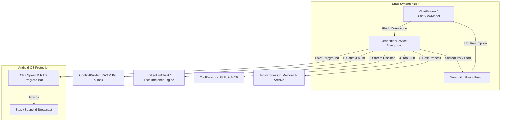

# 后台生成架构 GenerationService 实施计划 (ADR-004)

> **当前日期**: 2026-05-20
> **状态**: 📋 纯开发讨论规划立项阶段
> **文档位置**: `.agent/plans/20260520-generation-service-architecture.md`

---

## 1. 背景与核心痛点

目前，Nexara 的核心生成逻辑（包括 Context 组装、RAG 检索、LLM 流式收集、Tool 调用递归循环、向量化后处理归档、长对话自动摘要）全部承载在 `ChatViewModel.kt` 的 `viewModelScope` 中。这种“UI 绑定型生命周期”在复杂的移动端环境中暴露出了严重的鲁棒性隐患：

1. **退后台中断**：当用户切出 App 发送其他消息或锁屏时，一旦 Activity 被系统回收或 ViewModel 被销毁，正在进行的流式大模型输出或本地 Vulkan GPU JNI 推理将被强制 Cancel，导致对话链断裂。
2. **敏感持久化崩坏**：大模型生成完毕后，触发的 `addTurnToMemory` 记忆存储、向量归档 (`archiveMessagesToRag`)、本地数据库摘要更新属于耗时的敏感写入，如果在写入中途因 UI 销毁而中止，极易造成本地 SQLite/Vector DB 的数据状态不一致。
3. **本地端侧推理不稳定**：本地 llama.cpp JNI 加载 GGUF（数 GB 内存占用）且进行高密集计算，极易在退后台时被 Android OS 作为高能耗进程优先查杀。需要拥有专属 Foreground 优先级的守护进程级别运行环境。

---

## 2. 核心架构设计

为了达成全天候、高可靠的生成体验，我们设计了 **`GenerationService` 前台服务底座**。它将作为一个独立的长生命周期组件，负责托管整个 RAG & 大模型生成流水线。

### 2.1 全景模块架构



### 2.2 前台服务保活与 Android 14+ 适配

自 Android 14 (API 34) 起，前台服务必须声明具体的 `foregroundServiceType`。鉴于 Nexara 涉及 RAG 本地数据分发、向量提取写入，以及端侧大模型文件读写，最契合的类型为 `dataSync`（数据同步）。

#### 1. Manifest 权限与组件声明
```xml
<!-- 前台服务基本权限 -->
<uses-permission android:name="android.permission.FOREGROUND_SERVICE" />
<!-- Android 14+ 特性前台类型权限 -->
<uses-permission android:name="android.permission.FOREGROUND_SERVICE_DATA_SYNC" />
<!-- Android 13+ 通知权限，用以显示生成进度常驻条 -->
<uses-permission android:name="android.permission.POST_NOTIFICATIONS" />

<application ...>
    <service
        android:name=".data.local.service.GenerationService"
        android:enabled="true"
        android:exported="false"
        android:foregroundServiceType="dataSync" />
</application>
```

#### 2. 常驻前台通知与交互设计
Service 启动时，自动绑定一个常驻前台 Notification。
* **通知展现**：
  * **主标题**：正在生成 AI 响应...
  * **副标题/内容**：实时显示当前 CPS 生成速率（例如 `12.5 tokens/sec`）或 RAG 状态（`✓ 引用内容就绪 | 正在输出文字...`）。
  * **进度指示**：加入 ProgressBar，当在 RAG 阶段时，与全局 of the `RagPhases` 联动。
* **交互按钮**：
  * **“停止” 按钮**：通过 PendingIntent 发送自定义广播给 `GenerationService`，内部触发 `generationJob?.cancel()` 优雅中止当前生成，并向数据库中写入已生成的部分内容，防止数据损坏。

---

## 3. 双端 Binder 交互与“热续接 (Hot Resumption)”

为了彻底解耦 ViewModel 与 Service，我们采用 **双向 Binder 通信 + 实时事件 SharedFlow 订阅** 架构。

### 3.1 跨组件事件协议 (GenerationEvent)

Service 向外暴露一个只读的 `SharedFlow<GenerationEvent>`，ViewModel 在绑定 Service 后立刻订阅它：

```kotlin
sealed class GenerationEvent {
    data class RagProgressChanged(val phases: List<RagPhase>) : GenerationEvent()
    data class TextDeltaReceived(val content: String, val reasoning: String?) : GenerationEvent()
    data class ToolCallDetected(val toolCalls: List<ToolCall>) : GenerationEvent()
    data class ErrorOccurred(val error: String) : GenerationEvent()
    data object Completed : GenerationEvent()
}
```

### 3.2 Binder 通信设计与重绑定复用

```kotlin
class GenerationService : Service() {
    private val serviceScope = CoroutineScope(SupervisorJob() + Dispatchers.IO)
    private val _eventFlow = MutableSharedFlow<GenerationEvent>(replay = 20, extraBufferCapacity = 50)
    val eventFlow = _eventFlow.asSharedFlow()

    private var activeSessionId: String? = null
    private var generationJob: Job? = null

    inner class GenerationBinder : Binder() {
        fun getService(): GenerationService = this@GenerationService
    }

    override fun onBind(intent: Intent): IBinder = GenerationBinder()

    fun startGeneration(
        sessionId: String, 
        userMsgId: String, 
        assistantMsgId: String, 
        userContent: String
    ) {
        if (activeSessionId == sessionId && generationJob?.isActive == true) {
            // 当前会话已经在生成中，UI 重绑定即可，无需重启 Job —— 达成“热续接”
            return 
        }
        
        cancelActiveGeneration()
        activeSessionId = sessionId
        
        generationJob = serviceScope.launch {
            // 将原 ChatViewModel.generateMessage() 的 RAG + LLM + PostProcess 逻辑无缝移植于此
            // 通过 _eventFlow.emit() 实时向上层分发事件
        }
    }
    
    fun cancelActiveGeneration() {
        generationJob?.cancel()
        activeSessionId = null
    }
}
```

---

## 4. 本地端侧推理 JNI (llama.cpp) 在后台服务中的三槽位安全防线

本地推理模块加载数 GB 的 GGUF，是内存与能耗大户。将其运行在前台服务中，可以通过 Service 生存期极佳的优先级（Android 进程优先级提升为 `FOREGROUND_APP` 级别）防止在退后台瞬间被 OS 查杀。

同时，我们在 Service 内部设立 **“三槽位主动防御屏障”**：
1. **进程内存预警检测**：在 Service 中重写 `onTrimMemory(level: Int)`。当系统发生高内存压力（如 `TRIM_MEMORY_RUNNING_CRITICAL` 或 `TRIM_MEMORY_BACKGROUND`）时，主动释放 RERANK（重排槽）和 EMBEDDING（向量槽）中闲置 of the `LlamaContext` 物理句柄，仅保留 MAIN 槽以确保基础生成。
2. **显式硬件 Vulkan 隔离释放**：在调用 `nativeFree` 时，前台服务确保在 `onDestroy` 周期内强制执行，杜绝 JNI 内存泄漏导致极易发生 native 崩溃。
