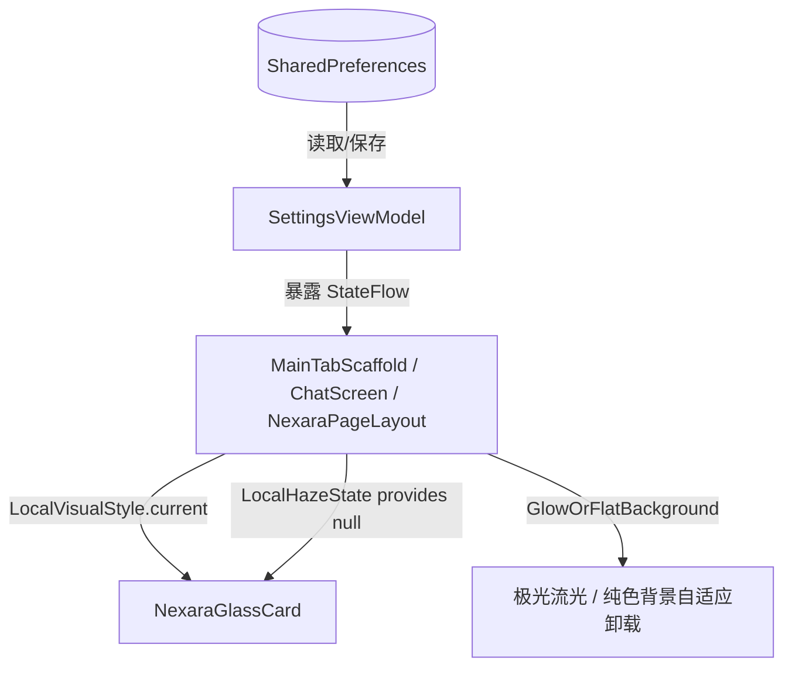

# ADR-019: 经典 MD3 与极光毛玻璃免重启热切换架构

## 上下文与背景

在 Nexara Android 原生客户端的视觉现代化升级中，我们引入了基于 `Haze` 库的实时 GPU 高斯物理毛玻璃以及 `NexaraGlowBackground` 的灵动流光极光背景。这虽然带来了奢华拟真的晶莹剔透玻璃质感，但也引入了如下工程挑战：
1. **能耗与性能**：GPU 高斯卷积和后台 Canvas 流光动画需要消耗更多的硬件资源。在部分中低端设备或省电模式下，用户更需要高能效、无动画的极简经典原生界面。
2. **美学偏好差异**：部分用户更偏好 Android 官方纯粹、干净、扁平的原生 Material 3 (MD3) 设计语言。
3. **残留代码干扰**：历史上为了在无 Haze 情况下模仿毛玻璃，界面中散落着很多生硬的半透明度叠色、渐变描边和射线图案，导致非毛玻璃模式（经典 MD3）下的视觉表现不纯正。

因此，我们需要设计一种**免重启、毫秒级热切换**的架构，在“极光物理毛玻璃”与“原生经典 MD3”双相视觉之间无缝流转，并且在经典 MD3 模式下彻底卸载 Haze 采样树、Canvas 极光背景和动画协程，做到物理纯净化与零额外能耗。

## 架构决策

我们决定设计并实施以下 **视觉双相热切换架构 (Double-Phase Theme Hot-Switch Architecture)**：



### 1. 偏好状态模型与 CompositionLocal 穿透
*   新增 `VisualStyle` 枚举定义两大风格：
    *   `HAZE_GLASSMORPHISM`：高奢物理毛玻璃 + 动态流光极光。
    *   `NATIVE_MATERIAL_3`：官方经典扁平 Material 3，纯色深暗底盘。
*   在 `SettingsViewModel` 中持久化偏好至 SharedPreferences，并将其暴露为响应式的 `StateFlow<VisualStyle>`。
*   通过 `LocalVisualStyle` 作为 `CompositionLocal` 穿透整个 Composable 渲染树，让叶子节点组件可以直接获取到全局视觉模式而无需逐级传递参数。

### 2. CompositionLocal 零改动一键优雅降级
*   物理毛玻璃卡片（`NexaraGlassCard`）的模糊特效强依赖于 `LocalHazeState.current` 提供的采样源。
*   当系统切换为 `NATIVE_MATERIAL_3` 模式时，在顶层容器（如 `ChatScreen.kt`、`NexaraPageLayout.kt`）中，无条件将 `LocalHazeState` 赋值为 `null` 注入：
    ```kotlin
    CompositionLocalProvider(
        LocalHazeState provides (if (isM3) null else hazeState)
    )
    ```
*   在 `NexaraGlassCard.kt` 内部，若 `LocalHazeState.current == null`（即 M3 模式），则自动将其 `.hazeEffect` 物理模糊模块完全卸载，彩虹渐变发光描边和霓虹渗透层全部关停，优雅退化为具有标准 `tonalElevation` 和 `surfaceVariant` 纯色底盘的标准 Material 3 卡片。
*   如此设计，使得 60+ 个业务调用点无需做任何签名或参数变动，自动完美适配双相视觉。

### 3. 流光 Canvas 动画物理卸载（零功耗保障）
*   如果仅仅隐藏极光背景，后台的 Canvas 流光动画协程仍然会在 GPU 中以 60Hz/120Hz 刷新，消耗额外电力。
*   为此，设计了自适应辅助组件 `GlowOrFlatBackground`，利用 Compose 的条件组合机制：
    *   当处于 `HAZE_GLASSMORPHISM` 模式时，将 `NexaraGlowBackground` 实例化并装载到渲染树。
    *   当处于 `NATIVE_MATERIAL_3` 模式时，**彻底将 `NexaraGlowBackground` 从 Composable 组合树中剔除/解耦**，仅渲染 `Box` 并填充标准的 `NexaraColors.CanvasBackground` 纯色。
    *   通过彻底断开组合（Composition Discard），底层的流光动画协程及 Canvas 重绘被物理销毁，实现纯 MD3 下的 **0% 额外 CPU/GPU 负载**。

### 4. 历史脏代码大清洗
*   彻底清理了 `ChatTopBar`、`MainTabScaffold`、`UserSettingsHomeScreen` 及 `NexaraGlassCard` 中此前尝试模拟毛玻璃的硬编码半透明度、发光描边、半透明 Overlay 等杂质色块。
*   在 `NATIVE_MATERIAL_3` 模式下，所有的背景、顶栏分割线、底栏均严格向官方 Material 3 Spec 靠拢，展现纯正地道的扁平设计。

## 效果与收益

1.  **免重启毫秒级切换**：用户在设置中勾选视觉主题时，整个 App 瞬间响应，无白屏、无闪烁。
2.  **极优的能效表现**：当切换到 MD3 模式时，所有的毛玻璃采样与大背景 Canvas 动画在物理层面上全量停用，耗电降为常规 Material 3 应用水平。
3.  **零重构成本**：基于 CompositionLocal 的隐式参数穿透，所有现存的 `NexaraGlassCard` 和 `NexaraPageLayout` 业务层使用方完全不感知底层的热退化逻辑，在零重构成本下获得了完美的双相设计。
