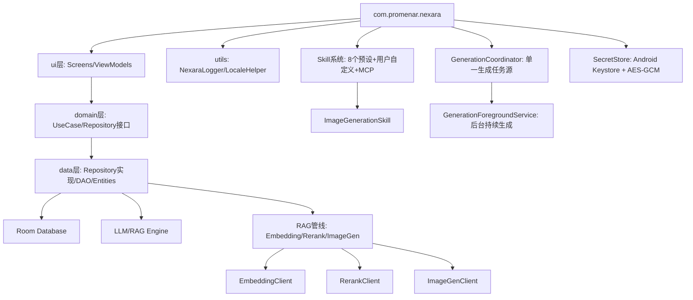

# Nexara Architecture 全景

> **最后更新**: 2026-07-20
> **注意**: 本文档为快速参考。完整架构设计见 [ARCHITECTURE_DESIGN.md](./ARCHITECTURE_DESIGN.md)（理想架构 + 技术路线择优），实现进度与差距分析见 [IMPLEMENTATION_ANALYSIS.md](./IMPLEMENTATION_ANALYSIS.md)。

## 核心架构
本项目是一个基于 Kotlin/Jetpack Compose 的原生 AI 助手应用，采用了典型的 MVVM 架构。

### 模块依赖关系

### 关键组件
- **NexaraApplication**: 全局上下文管理与服务初始化（嵌入/重排/图像生成客户端均在此懒加载）；`onCreate()` 自动创建 `WorkSpace` 物理目录；同时持有唯一 Application 级 `ThemePreferenceStore`。
- **ThemePreferenceStore / NexaraTheme**: `ThemePreferenceStore` 是 `theme_mode` 与 `theme_color_source` 的唯一可变事实源，监听备份恢复产生的偏好变化并通过 `StateFlow` 发布；`MainActivity` 按生命周期收集后交给根 `NexaraTheme`，统一解析系统明暗、Nexara 双配色、Android 12+ 动态色及系统栏图标外观。
- **NexaraPageLayout / NexaraSettingsSection / NexaraSearchTopBar**: 管理页面共享 Material 3 骨架。页面根统一持有 system bars 与可选 IME insets；设置区使用透明连续列表和正文对齐分隔线；搜索由调用方持有 query/active 状态，Top App Bar 只负责焦点、IME、清除、返回优先级和 reduced-motion 兼容过渡。
- **NavGraph**: 基于 Compose Navigation 的路由中心（27 条路由）。
- **Domain 层**: `domain/model/`（6 文件）+ `domain/repository/`（9 接口）+ `domain/usecase/`（6 UseCase），零 Android 依赖。
- **Repository 层**: 9 个数据仓库实现（Agent/Document/Folder/KG/Message/Provider/Session/TokenStats/Vector），覆盖率 100%。
- **ContextBuilder**: 负责多源上下文（RAG/Web/KG/History）的异步调度、打分与 Prompt 合成，支持实时观测回调。所有子源均已接入 NexaraLogger 错误追踪。
- **MemoryManager**: 核心 RAG 检索引擎，集成 Embedding/Rerank/Hybrid Search 三阶段检索管线。embedQuery/search/rerank 全路径接入日志。
- **VectorizationQueue / DocumentIndexService / PendingDocumentIndexCoordinator**: 文档/记忆持久队列、候选索引事务服务与应用级补偿目标协调器。文件内容先构建隔离向量/KG 候选，事务内复核 hash+epoch 后原子切换；旧 worker 使用目标 CAS，删除通过 cancel-and-join/fence 屏障线性化。Queue 尚未接收的已提交目标可跨页面重试，并由冷启动 missing-scan 按当前文件版本与 KG 配置恢复。启动恢复只清理缺少身份或已确认文件不存在的旧版 `document` 孤儿任务，现代 `document_reference` 目标继续遵守 hash+epoch 契约。
- **WorkspaceRepository / WorkspaceDeletionTransaction**: Session root 作用域文件仓储。永久删除把派生索引与文件记录纳入同一 Room 事务，并用稳定 tombstone 恢复物理删除的进程死亡窗口。
- **DocEditorContentAccess / DocEditorViewModel**: 文档内容访问使用 `Editable / PerformanceProtected / MetadataOnly` 单一事实。文件大小严格超过 1 MiB 时不读取全文；已读取内容严格超过 32K 个 UTF-16 代码单元、2,000 行或单行 16K 个 UTF-16 代码单元时，仅向 Markdown 提供最多 16K 个 UTF-16 代码单元的快照，不构建全文 `BasicTextField`。完整 `content/persistedContent` 仍是复制、dirty、expected-hash CAS 保存与冲突处理的唯一数据源，预览 snippet 不得进入持久化路径。
- **SharedFileImporter / DurableShareInbox**: SAF 与系统分享共用的逐项导入管线；支持去重、容量重试、部分失败、崩溃恢复及索引回执。
- **GenerationCoordinator / ChatGenerationRunner**: 应用级唯一生成任务源。初版全局只允许一个活动任务；统一处理 Provider 路由、RAG/工具循环、流式增量持久化、取消与结构化错误终态。成功、失败与取消路径必须先把终态发布到 `GenerationPresentationStore`，再结束协调器活动状态，避免 UI 因事件顺序停留在生成中。
- **MessageDocumentAttachment / PreparedPromptBudgetGate / BranchSessionUseCase**: 输入栏 TXT/Markdown 以版本化消息快照进入完整用户上下文，与知识库检索分离；最终路由 Prompt 在 Provider 网络前按稳定模型覆盖和远端目录容量执行 fail-closed 门禁。重试只在新回复成功后替换旧回复；导出可回传，稳定消息分支重映射历史并清空运行态与工作区身份。
- **GenerationForegroundService**: 观察 Coordinator 的同一任务状态，通过 `dataSync` 前台服务在切后台、锁屏、旋转或 Activity 重建后继续当前生成；通知可返回准确会话或停止任务。设备重启续传、多会话并行和定时任务不在 `v0.2-beta` 范围。
- **SecretStore / SecretCatalog**: Android Keystore 生成不可导出的 AES-GCM 主密钥；普通偏好只保存密文、IV 与格式版本。Provider、Vertex、搜索、Embedding 和 WebDAV 凭据由稳定 SecretId 管理，UI 只持有存在性和短生命周期 reveal 内容。
- **BackupRepository / BackupPackageCodec**: 核心数据采用清单、逐项 SHA-256 和事务恢复；密钥默认排除，显式包含时使用备份密码派生的 AES-256-GCM 密钥加密。恢复先验证再写入，错误密码、损坏包和越界内容不得产生部分写入。
- **ModelMetadataResolver / ModelCatalogRuntime**: 模型元数据唯一领域入口。运行时只读取仓库内固定的 models.dev 离线快照和 Nexara 精确修正，再按字段叠加 Provider 元数据与用户覆盖；精确名称、工作负载、三态能力、token 限制和来源可追踪，家族规则不得覆盖精确字段。
- **MicroGraphExtractor/GraphExtractor**: 知识图谱提取引擎（JIT 缓存 + 全量提取双模式），全链路接入日志。
- **ImageGenClient**: OpenAI-compatible 图像生成 API 客户端，支持 url/b64_json 响应格式。
- **ImageGenerationSkill**: `generate_image` 工具实现，LLM 可调用生成图片并内联展示在对话气泡中。
- **RagOmniIndicator**: 基于磨砂玻璃设计的全能检索指示器，集成在对话流中展示检索深度与进度。
- **NexaraLogger**: Debug 构建的统一脱敏日志和 Metro 事件边界；Release 入口受 `BuildConfig.DEBUG` 门禁并由 R8 精确剥离，业务源码禁止直接写平台日志或完整堆栈。
- **AgentHubScreen**: Agent 列表中枢（Super Assistant 已于 2026-05-13 清理）。

### 架构决策记录 (ADR)
- **ADR-001 (2026-05-13)**: **取消 Super Assistant 概念** — 统一 Agent 模型，移除 `isSuperAssistant` 特殊逻辑。✅ 已实施（Phase 3, 2026-05-13）。
- **ADR-002 (2026-05-14)**: **Embedding/Rerank 配置回退策略** — 当专用键为空时回退到主 LLM Provider 配置。✅ 已实施。
- **ADR-003 (2026-05-14)**: **图像生成工具设计** — 以 Skill 模式实现 `generate_image` 工具。✅ 已实施，详见 [ADR/image-generation-tool.md](./ADR/image-generation-tool.md)。
- **ADR-004 (2026-05-14；2026-07-13 落地)**: **后台生成架构** — 由应用级 `GenerationCoordinator` 承载唯一任务状态，`GenerationForegroundService` 观察同一状态并维持前台发起的 SSE 生成；UI 不复制任务。✅ 已实施，发行级设备矩阵仍待最终门禁。
- **ADR-005 (2026-05-16)**: **NexaraPageLayout 架构重构** — 迁移至 Scaffold 架构，通过局部按需应用 `imePadding` 与 `weight(1f)` 彻底解决键盘避让与测量崩溃问题。✅ 已实施。
- **ADR-006 (2026-05-16)**: **数据库架构一致性校验修复** — 修复了因 Entity 变更与 Migration 缺失导致的 Room 完整性校验崩溃。通过强制升级至 v11 并补充 `defaultValue` 确保架构闭环。✅ 已实施。
- **ADR-007 (2026-05-16)**: **RAG 知识库现代化改造** — 引入多选批处理架构与双模式 Markdown 编辑器。通过状态提升（State Hoisting）同步 FilesPanel 与屏幕级 UI，并集成 `MarkdownText` 引擎替代旧的文本高亮逻辑。✅ 已实施。
- **ADR-008 (2026-05-16)**: **RAG 可观测性增强** — 向量化/Memory/MicroGraph/KnowledgeGraph/RAG Retrieval 五条管线全部接入 NexaraLogger，消除 25+ 个静默 catch 块，实现全链路错误可追踪。✅ 已实施。
- **ADR-009 (2026-05-16)**: **提示词编辑器原子化标准化** — 全站统一使用 `UnifiedPromptEditor` (预览/编辑双模式) 替代所有异构的 `BasicTextField` 或 `FloatingTextEditor` 提示词输入框，确保交互一致性并支持 Markdown 预览。✅ 已实施。
- **ADR-010 (2026-05-16)**: **Provider 管理多路保存** — 修复 `onSave` 始终写入主提供商的致命 Bug，改为三路分发（新增额外/编辑主/编辑额外）；模型列表按 `providerId` 作用域过滤；移除自动网络拉取。✅ 已实施。
- **ADR-011 (2026-05-16)**: **模型能力数据库 2026-04 更新** — ModelSpec 新增 `maxOutputTokens`/`knowledgeCutoff` 维度；覆盖 117+ 模型，含 GPT-5 全系 / Claude Sonnet 5 / Gemini 3.1 / DeepSeek V4 / Qwen 3.6 / GLM-5.1 / Grok 4 / Gemma 4。✅ 已实施。
- **ADR-012 (2026-05-16)**: **Embedding 跨提供商配置解析架构** — 放弃基于 key-prefix 的模糊匹配，建立 `modelId -> providerId -> config` 的精确查找链路，并引入 `OnSharedPreferenceChangeListener` 实现全管线响应式配置更新。✅ 已实施。
- **ADR-013 (2026-05-18)**: **WebView 生命周期管理 — 测高 WebViewClient 前置绑定** — 修复 Compose `LaunchedEffect` 与 `AndroidView.update` 之间的时序竞态导致 WebView 高度测量失效的 P0 缺陷。✅ 已实施。
- **ADR-014 (2026-05-18)**: **工具调用系统架构移植 — 基于 Cherry-Studio 参考实现** — 引入中间件管线（`LlmMiddleware`/`LlmMiddlewareChain`）、统一 LLM 客户端（`UnifiedLlmClient`）、工具调用生命周期管理（`ToolCallLifecycleHandler`）、DSML 流式解析（`DsmlStreamParser`）、Provider 原生工具工厂（`ProviderToolFactory`）、搜索意图编排（`ToolOrchestrationPlugin`）、多模态结果压缩（`ResultSizeOptimizer`）。根治 10 项工具调用缺陷。✅ 已实施。
- **ADR-015 (2026-05-18)**: **Nexara Metro 调试桥系统 (Phase 1)** — 对标 React Native Metro Server 的非侵入、全链路、无 Socket 双端调试桥。通过 Room 审计回调、OkHttp SSE 拦截拦截器、LlmMiddleware 中间件在 DEBUG 下以结构化格式流式打印，在桌面配合 Node.js TUI 解析器实现 100% 零网络阻碍的秒级极速调试。✅ 已实施。
- **ADR-016 (2026-05-18)**: **CancellationException 传播模式与 channelFlow 生命周期规范** — 两项结构性缺陷根治：(1) 4 个协议类 `sendPromptSync` 的 `catch (e: Exception)` 捕获了 `CancellationException`，违反 Kotlin 结构化并发契约，导致 `withTimeoutOrNull` 失效。修复方案：在所有 `catch (e: Exception)` 前插入 `catch (e: CancellationException) { throw e }` 透传。(2) `UnifiedLlmClient.sendStream()` 使用 `channelFlow { ... awaitClose {} }`，底层协议流结束后 `awaitClose {}` 无限期挂起导致 Flow 永不完成，造成 `isGenerating` 卡死。修复方案：移除 `awaitClose {}`，让 `channelFlow` 在代码块结束时自然完成。同时 `ChatViewModel.generateMessage()` 添加 `try-finally` 确保任何退出路径都重置 `isGenerating`。✅ 已实施。
- **ADR-017 (2026-05-18)**: **知识图谱可视化 176+ 大数据量防崩溃与性能优化** — 彻底根治 ECharts 大数据量下悬挂边（Dangling Edges）导致的 JS 解析致命崩溃、无初始布局（`initLayout`）导致的坐标重叠斥力爆炸（NaN），以及 category 索引越界和连线模板解析异常。在 `kg_template.html` 中引入前置悬挂边安全过滤映射表、显式圆周初始布局（`circular`）、精细化的力导向参数调优（手机端 `repulsion: 120`）、安全类别降级映射与 Formatter 回调，并配合全局 try-catch 和红色报错卡片展示，实现 100% 可视化防崩溃与 3 倍以上的渲染收敛性能。✅ 已实施。
- **ADR-019 (2026-07-13)**: **工作区文件、派生索引与删除恢复采用事务候选切换** — 重索引失败保留旧结果；永久删除统一清理派生数据；稳定 tombstone 与持久队列覆盖进程死亡恢复。✅ 已实施，详见 [ADR-019](./ADR/ADR-019-transactional-workspace-indexing.md)。
- **ADR-020 (2026-07-18)**: **分层模型元数据注册中心** — 采用逐字段来源优先级、精确 ID、离线目录、三态能力与用户覆盖迁移；推理能力和 Chat endpoint 兼容性保持独立。✅ 已实施，当前候选真实 Provider 复验仍为 PENDING，详见 [ADR-020](./ADR/ADR-020-layered-model-metadata-registry.md)。
- **ADR-021 (2026-07-20)**: **会话完整文档上下文与消息分支** — TXT/Markdown 以持久快照完整进入 Prompt，路由后执行预算硬门禁；导出可回传，重试不丢旧回复，稳定消息可创建独立分支。✅ 已实施，详见 [ADR-021](./ADR/ADR-021-chat-full-context-documents-and-branching.md)。

### 新增关键组件 (2026-05-18 移植 & 调试桥落地)
- **UnifiedLlmClient**: 统一 LLM 调用入口，整合中间件链 + ToolCallLifecycleHandler，自动路由 Protocol。
- **LlmMiddlewareChain**: 可扩展中间件管线，支持 PRE/NORMAL/POST 三级 enforce 排序，链式包装 `transformStreamChunk`。
- **ToolCallLifecycleHandler**: 工具调用全生命周期管理（streaming→pending→complete），去重避免重复 chunk。
- **DsmlStreamParser**: DeepSeek DSML 格式 `<｜tool_calls｜>` XML 标签流式解析，支持跨 chunk 边界 + 缓冲区溢出保护。
- **ProviderToolFactory**: 7 个 Provider（OpenAI/Anthropic/Google/xAI/Hunyuan/DashScope）的原生 Web 搜索工具定义。
- **ToolOrchestrationPlugin**: 意图分析（关键词检测）+ 动态工具注入（web_search/knowledge_search/memory_search）。
- **ResultSizeOptimizer**: 多模态 MCP 结果 → 文本占位符转换，防 base64 超出消息大小限制。
- **MetroLogInterceptor**: 自定义 OkHttp 引擎拦截器，使用 Okio ForwardingSource 对流式 SSE (Server-Sent Events) API 响应进行非阻塞抓包，解析 chunk 并计算 Token CPS 速率。
- **MetroLoggingMiddleware**: 大模型中间件管线，拦截 `onRequestStart` / `onRequestEnd` 两个节点，高密度捕获大模型参数、滑窗历史消息和系统提示词。
- **Room QueryCallback Auditor**: 零侵入数据库 SQL 拦截。在 NexaraApplication 中直接挂载，捕获 Message / Session / TaskNode 表的所有底盘 SQL 操作。
- **scripts/nexara-metro-tui.js**: 零运行时依赖的 Node.js Debug 日志 TUI，支持 adb/标准输入、设备与 Tag 选择、TTY/非 TTY 输出、中文错误与稳定退出码。它是开发者观测工具，不是最终用户 CLI；Release 不包含可用的 Metro 调试链路。
- **Developer Panel**: 二级设置页面，用于导出日志 (`nexara_logs.txt`)。
- **Log Persistence**: 路径为应用私有 files 目录。
