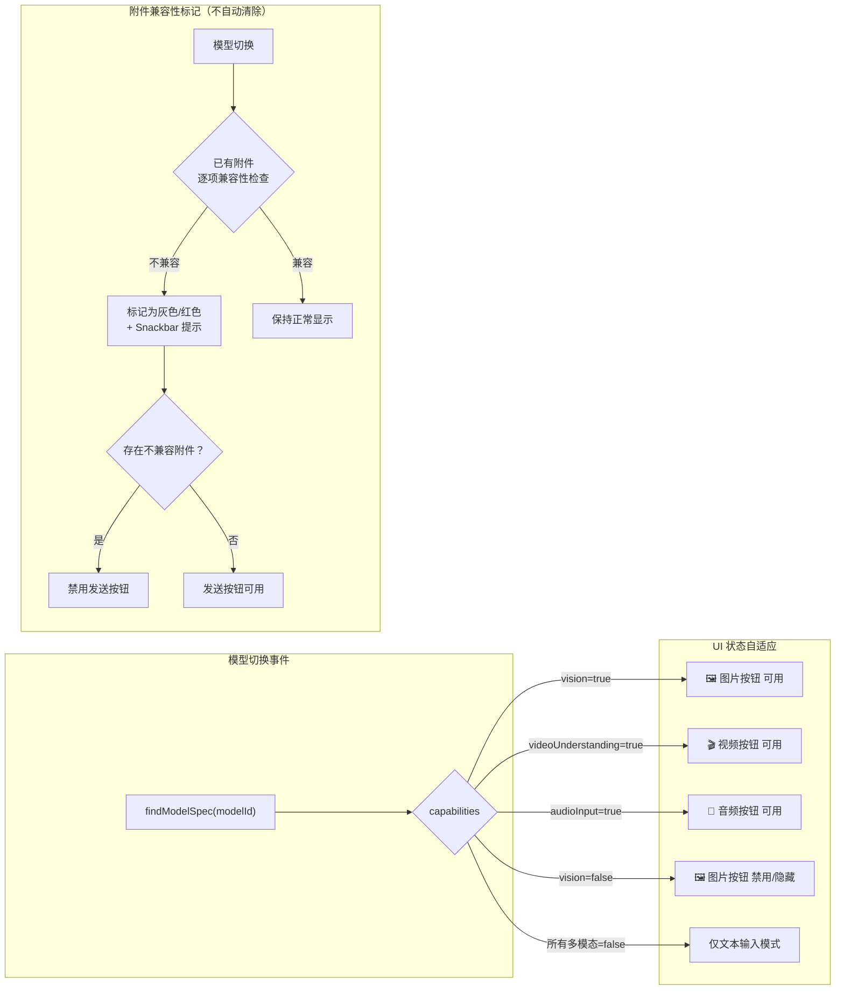

# LLM 会话管线多模态支持审计与增强方案

## 背景

审计 Nexara 的 LLM 会话管线（前端 Compose UI + 后端协议层）对图片、视频、文档等多模态格式的支持能力，并规划在多模态模型与纯文本/推理模型之间热切换时 UI 组件的状态变化方案。

---

## 审计结果总览

### ✅ 已完备的环节

| 层级 | 组件 | 现状 | 评级 |
|------|------|------|------|
| **数据模型** | `Message.userImages` | 已支持 Base64 Data URL 列表持久化 | ✅ |
| **协议层** | `ProtocolMessage.imageUrls` | 已定义 `List<ImageInput>?` | ✅ |
| **协议层** | `ProtocolMessage.audioData` | 已定义 `List<AudioInput>?` | ✅ |
| **协议层** | `ProtocolMessage.documentData` | 已定义 `List<DocumentInput>?` | ✅ |
| **Provider 适配** | `OpenAIProtocol` | 已实现 image + audio content parts 序列化 | ✅ |
| **Provider 适配** | `GenericOpenAICompatProtocol` | 已实现 image + audio content parts 序列化 | ✅ |
| **Provider 适配** | `AnthropicProtocol` | 已实现 image + document content parts（PDF base64）| ✅ |
| **Provider 适配** | `VertexAIProtocol` | 已实现 image + audio + document inline_data | ✅ |
| **ViewModel** | `sendMessage(text, imageUris)` | 已实现 URI → Base64 编码 + `ImageInput` 传导 | ✅ |
| **ViewModel** | `buildProtocolMessages()` | 已实现 `userImages` → `ImageInput` 映射 | ✅ |
| **UI 展示** | `UserMessageBubble` | 已渲染 `userImages` Base64 Data URL（Coil AsyncImage）| ✅ |
| **模型能力数据库** | `ModelCapabilities` | 已定义 `vision`、`audioInput`、`videoUnderstanding` 字段 | ✅ |
| **模型规格库** | `MODEL_SPECS` | 70+ 模型已标注多模态能力（vision/audio/video）| ✅ |

### ❌ 缺失或不完整的环节

| 层级 | 缺陷 | 严重性 | 说明 |
|------|------|--------|------|
| **前端 — 文件选择** | 仅支持 `image/*` MIME | 🔴 P0 | `imagePickerLauncher.launch("image/*")` 硬编码，无法选择视频/文档 |
| **前端 — 附件预览** | 仅图片预览，无视频/文档缩略图 | 🔴 P0 | `selectedImageUris` 仅渲染为图片缩略图，无通用附件组件 |
| **ViewModel — 数据桥接** | 仅处理图片 URI，未桥接 audio/document | 🔴 P0 | `sendMessage()` 仅做 `image/*` 的 Base64 编码，无 video/doc 路径 |
| **ViewModel — 协议注入** | `buildProtocolMessages()` 未注入 `audioData`/`documentData` | 🔴 P0 | 协议字段存在但从未被填充 |
| **前端 — 模型能力感知** | 输入栏无模型能力条件守卫 | 🟡 P1 | 切换到纯文本模型时，图片按钮仍可用 |
| **前端 — 热切换清理** | 模型切换后不清理已选附件 | 🟡 P1 | 切换到纯文本/推理模型后，已选图片留存 |
| **前端 — 发送守卫** | 无发送前能力校验 | 🟡 P1 | 用户可向纯文本模型发送图片（静默丢弃或 API 报错）|
| **数据模型** | `Message` 无统一附件字段 | 🟡 P2 | `userImages` 仅存图片，无 video/doc 持久化字段 |

---

## User Review Required

> [!IMPORTANT]
> **P0 缺陷**：当前系统虽然**协议层已完备**（`ImageInput`/`AudioInput`/`DocumentInput` 全部定义且各 Provider 已适配），但**前端 UI 和 ViewModel 桥接层存在根本性断裂**——用户无法选择和发送图片以外的任何多模态格式。

> [!WARNING]
> **热切换风险**：当用户在会话中途将模型从多模态（如 GPT-4o、Gemini 3.1 Pro）切换为纯文本/推理模型（如 DeepSeek R1、O3-mini）时，已选的图片附件会被静默发送并可能导致 API 错误。需要加入能力感知守卫。

---

## Resolved Decisions

> [!IMPORTANT]
> 1. **视频：不做客户端压缩/转码** — Android 上 MediaCodec 转码 CPU/电量消耗过大，30 秒 1080p 视频可能需要 30-60 秒。改为分级大小策略：≤10MB 直接发送，10~50MB 弹出耗时警告，>50MB 拒绝选择。原始 Base64 直传。
> 2. **文档格式：广格式支持 + 客户端文本提取** — 项目已引入 Apache POI (`5.2.5`) + PDFBox Android (`2.0.27.0`)，覆盖 DOCX/XLSX/PPTX/PDF。大多数模型无法处理 Office 二进制，必须在客户端提取文本后注入 `content`。PDF 对支持原生 PDF 的模型（Claude）传原始 Base64，其余模型用 PDFBox 提取文本。
> 3. **热切换策略：保留附件 + 禁用发送 + 持久化** — 模型切换时不自动清除附件，而是将不兼容附件视觉标记（灰色/红色标签），禁用发送按钮直到用户手动移除不兼容项或切回兼容模型。附件元数据持久化到 `Message.attachments`。

---

## Parallel Execution Strategy

**4 个 Worker 完全并行，零文件冲突。**

```
┌─────────────────────────────────────────────────────────────┐
│                     主 Agent（监工）                          │
│  职责：接口契约定义、并行调度、最终编译验证、DIA 检查            │
└──────────┬──────────┬──────────────┬─────────────┬───────────┘
           │          │              │             │
     ┌─────▼────┐ ┌───▼──────┐ ┌────▼─────┐ ┌────▼──────┐
     │Worker-A  │ │Worker-B  │ │Worker-C  │ │Worker-D   │
     │数据模型   │ │ViewModel │ │前端 UI   │ │气泡渲染    │
     │+文档提取  │ │桥接重构   │ │选择器+守卫│ │多格式渲染  │
     ├──────────┤ ├──────────┤ ├──────────┤ ├───────────┤
     │ChatModels│ │ChatView  │ │ChatScreen│ │Pipeline   │
     │  .kt     │ │Model.kt  │ │  .kt     │ │Bubble.kt  │
     │+新建     │ │          │ │+新建预览 │ │           │
     │Extractor │ │          │ │  Row     │ │           │
     └──────────┘ └──────────┘ └──────────┘ └───────────┘
```

**接口契约（所有 Worker 共识）**：

```kotlin
// ChatModels.kt 中新增
@Serializable
data class Attachment(
    val uri: String,
    val mimeType: String,
    val fileName: String = "",
    val sizeBytes: Long = 0,
    val type: AttachmentType = AttachmentType.IMAGE
)

@Serializable
enum class AttachmentType { IMAGE, VIDEO, AUDIO, DOCUMENT }

// Message 类新增字段
val attachments: List<Attachment>? = null
```

```kotlin
// ChatViewModel.kt 新签名
fun sendMessage(text: String, attachments: List<Attachment> = emptyList())
```

---

## Proposed Changes

### Phase 1: 统一附件模型与 ViewModel 桥接 (P0)

---

#### [MODIFY] [ChatModels.kt](file:///Users/promenar/Codex/Nexara/native-ui/app/src/main/java/com/promenar/nexara/data/model/ChatModels.kt)

新增统一附件数据结构：

```kotlin
@Serializable
data class Attachment(
    val uri: String,           // 原始 URI 或 Data URL
    val mimeType: String,      // "image/jpeg", "video/mp4", "application/pdf"
    val fileName: String = "", // 显示用文件名
    val sizeBytes: Long = 0,   // 文件大小
    val type: AttachmentType = AttachmentType.IMAGE
)

@Serializable
enum class AttachmentType {
    IMAGE, VIDEO, AUDIO, DOCUMENT
}
```

在 `Message` 类中新增 `attachments: List<Attachment>? = null` 字段，与现有 `userImages` 共存（向下兼容）。`Attachment` 仅持久化元数据（uri/mimeType/fileName/sizeBytes/type），不含运行时兼容性状态。

**文档文本提取处理器**（新建 `AttachmentTextExtractor.kt`）：

```kotlin
object AttachmentTextExtractor {
    suspend fun extractText(context: Context, uri: Uri, mimeType: String): String? = withContext(Dispatchers.IO) {
        when {
            mimeType.startsWith("application/pdf") -> extractPdfText(context, uri)
            mimeType == "application/vnd.openxmlformats-officedocument.wordprocessingml.document" -> extractDocxText(context, uri)
            mimeType == "application/vnd.openxmlformats-officedocument.spreadsheetml.sheet" -> extractXlsxText(context, uri)
            mimeType == "application/vnd.openxmlformats-officedocument.presentationml.presentation" -> extractPptxText(context, uri)
            mimeType.startsWith("text/") -> extractPlainText(context, uri)
            else -> null
        }
    }
}
```

- PDF → PDFBox (`PDDocument.load()` → `PDFTextStripper`)
- DOCX → Apache POI (`XWPFDocument` → 逐段落提取)
- XLSX → Apache POI (`XSSFWorkbook` → 逐行提取为 CSV 格式)
- PPTX → Apache POI (`XMLSlideShow` → 逐幻灯片提取文本)
- TXT/CSV/MD → 原生 `BufferedReader` 读取

---

#### [MODIFY] [ChatViewModel.kt](file:///Users/promenar/Codex/Nexara/native-ui/app/src/main/java/com/promenar/nexara/ui/chat/ChatViewModel.kt)

**`sendMessage()` 方法重构**：

- 将入参从 `imageUris: List<Uri>` 扩展为 `attachmentUris: List<Uri>`
- 根据 `contentResolver.getType(uri)` 的 MIME 前缀自动分类：
  - `image/*` → `ImageInput`（现有逻辑）
  - `video/*` → Base64 编码直传（**不做客户端压缩/转码**），注入为 `DocumentInput` 或模型特定格式
    - 文件大小分级：≤10MB 直接处理，10~50MB 弹出耗时警告后继续，>50MB 拒绝并提示
  - `application/pdf` → 支持原生 PDF 的模型（Claude）传原始 Base64 `DocumentInput`；其余模型用 `AttachmentTextExtractor` 提取文本注入 content
  - `application/vnd.openxmlformats-officedocument.*` → 通过 `AttachmentTextExtractor` 提取文本后注入 content
  - `text/*` → 直接读取为字符串，注入 `DocumentInput` 或 content
  - `audio/*` → `AudioInput`
- 附件持久化到 `Message.attachments`

**`buildProtocolMessages()` 方法增强**：

- 从 `msg.attachments` 或 `msg.userImages`（向下兼容）读取附件
- 按类型分发填充 `ProtocolMessage.imageUrls`、`ProtocolMessage.audioData`、`ProtocolMessage.documentData`

---

### Phase 2: 前端多模态附件选择器 (P0)

---

#### [MODIFY] [ChatScreen.kt](file:///Users/promenar/Codex/Nexara/native-ui/app/src/main/java/com/promenar/nexara/ui/chat/ChatScreen.kt)

**附件选择器升级**：

- 将 `GetMultipleContents("image/*")` 替换为 `OpenMultipleDocuments` 或使用更通用的 MIME 过滤
- 按当前模型能力动态构建 MIME 列表：
  - `vision = true` → 允许 `image/*`
  - `videoUnderstanding = true` → 允许 `video/*`
  - `audioInput = true` → 允许 `audio/*`
  - 文档始终允许（通过提取文本 fallback）

**附件预览区增强**：

- 将 `selectedImageUris` 重命名为 `selectedAttachments`
- 图片：保持现有缩略图逻辑
- 视频：显示 MIME 图标 + 文件名 + 时长/大小
- 文档：显示文档图标 + 文件名 + 文件大小
- 音频：显示音频图标 + 文件名 + 时长

---

#### [NEW] [AttachmentPreviewRow.kt](file:///Users/promenar/Codex/Nexara/native-ui/app/src/main/java/com/promenar/nexara/ui/chat/components/AttachmentPreviewRow.kt)

独立的附件预览条组件，支持：
- 统一的 `Attachment` 数据驱动
- 按类型渲染不同缩略图/图标
- 单项删除（点击 X 移除）
- 超出限制时的警告提示

---

### Phase 3: 模型能力感知与热切换守卫 (P1)

---

#### [MODIFY] [ChatInputBar](file:///Users/promenar/Codex/Nexara/native-ui/app/src/main/java/com/promenar/nexara/ui/chat/ChatScreen.kt#L969)

**新增参数**：

```kotlin
fun ChatInputBar(
    // ...existing params...
    modelCapabilities: ModelCapabilities? = null,  // 新增
    onAttachmentRejected: (String) -> Unit = {},   // 新增：能力不足时的提示回调
)
```

**能力感知逻辑**：

- `modelCapabilities?.vision != true` → 隐藏图片按钮，或替换为通用文档按钮
- `modelCapabilities == null`（未选模型）→ 保持现有行为
- 点击附件按钮时，仅弹出当前模型支持的 MIME 类型选择器

---

#### [MODIFY] [ChatScreen.kt — 模型切换事件](file:///Users/promenar/Codex/Nexara/native-ui/app/src/main/java/com/promenar/nexara/ui/chat/ChatScreen.kt)

**热切换响应（保留附件 + 禁用发送 + 持久化）**：

当 `session.modelId` 变化时：

1. 查询新模型的 `ModelCapabilities`（通过 `findModelSpec(newModelId)?.capabilities`）
2. 遍历 `selectedAttachments`，按新模型能力标记每个附件的兼容状态
3. **不自动清除附件**，而是：
   - 不兼容的附件 → 视觉上变灰/添加红色警告标签（如"当前模型不支持"）
   - 显示 Snackbar 提示："N 个附件与当前模型不兼容，请移除后发送"
4. **发送按钮行为**：
   - 存在不兼容附件时 → 发送按钮禁用（灰色）
   - 用户手动移除不兼容附件或切回兼容模型 → 恢复可发送
   - 也可提供"仅发送兼容附件"的快捷操作
5. **持久化**：附件元数据通过 `Message.attachments` 持久化到 Room 数据库，兼容性状态为运行时计算，不持久化

**实现方式**：

```kotlin
// ChatScreen.kt 中 — 附件兼容性为运行时派生状态
data class AttachmentWithCompat(
    val attachment: Attachment,
    val isCompatible: Boolean
)

val currentModelSpec = remember(uiState.session?.modelId) {
    uiState.session?.modelId?.let { findModelSpec(it) }
}
val capabilities = currentModelSpec?.capabilities

// 附件列表保持不变，兼容性作为派生状态
val attachmentsWithCompat = remember(selectedAttachments, capabilities) {
    selectedAttachments.map { att ->
        AttachmentWithCompat(
            attachment = att,
            isCompatible = capabilities?.let { cap ->
                when (att.type) {
                    AttachmentType.IMAGE -> cap.vision
                    AttachmentType.VIDEO -> cap.videoUnderstanding
                    AttachmentType.AUDIO -> cap.audioInput
                    AttachmentType.DOCUMENT -> true // 文档始终兼容（可提取文本）
                }
            } ?: true // 未选模型时默认兼容
        )
    }
}

val hasIncompatibleAttachments = attachmentsWithCompat.any { !it.isCompatible }
// hasIncompatibleAttachments = true → 禁用发送按钮
```

---

#### [MODIFY] [ChatInputBar — 按钮状态自适应](file:///Users/promenar/Codex/Nexara/native-ui/app/src/main/java/com/promenar/nexara/ui/chat/ChatScreen.kt#L992)

```
现有:  AddPhotoAlternate 图标，始终显示
改为:  
  - vision=true  →  AddPhotoAlternate（图片）
  - vision=true && videoUnderstanding=true  →  AttachFile（通用附件）
  - vision=false →  按钮变灰或隐藏，仅保留文档附件入口
```

---

### Phase 4: 用户气泡多格式渲染 (P2)

---

#### [MODIFY] [PipelineBubble.kt — UserMessageBubble](file:///Users/promenar/Codex/Nexara/native-ui/app/src/main/java/com/promenar/nexara/ui/chat/PipelineBubble.kt#L791)

增强用户消息气泡的附件渲染：

- **图片**：保持现有 `AsyncImage` 逻辑（从 `userImages` 或 `attachments` 读取）
- **视频**：显示视频缩略图 + 播放按钮覆盖层（点击使用 Intent 调起系统播放器）
- **文档**：显示文档图标 + 文件名 chip（可点击查看）
- **音频**：显示简易波形/进度条 + 播放按钮

---

## 模型能力 → UI 状态映射关系



---

## Verification Plan

### Automated Tests

```bash
# 编译验证
./gradlew :app:compileDebugKotlin

# 单元测试（附件分类逻辑、能力守卫逻辑）
./gradlew :app:testDebugUnitTest --tests "*AttachmentTest*"
./gradlew :app:testDebugUnitTest --tests "*ModelCapabilities*"
```

### Manual Verification

1. **图片发送**：选择多张图片 → 发送 → 验证 AI 气泡正确渲染 + 协议层正确注入 `ImageInput`
2. **视频发送（Gemini 模型）**：选择 MP4 → 发送 → 验证 `documentData` 被正确填充
3. **文档发送（Claude 模型）**：选择 PDF → 发送 → 验证 Anthropic 协议的 `document` content block
4. **热切换测试**：
   - 选择 GPT-4o → 添加图片 → 切换到 DeepSeek R1 → 验证图片被标记为不兼容（灰色）+ 发送按钮禁用 + Snackbar 提示
   - 手动移除不兼容图片 → 验证发送按钮恢复可用
   - 切回 GPT-4o → 验证图片恢复兼容状态
   - 选择 Gemini 3.1 Pro → 添加视频 + 图片 → 切换到 Claude 3.5 Haiku → 验证视频被标记不兼容但图片保留兼容
5. **纯文本模型**：选择 O3-mini → 验证附件按钮隐藏/禁用
6. **文档发送**：
   - DOCX → 验证文本提取后正确注入 content
   - XLSX → 验证表格数据以 CSV 格式注入 content
   - PPTX → 验证逐幻灯片文本注入 content
   - PDF（Claude 模型）→ 验证原始 Base64 注入 `DocumentInput`
   - PDF（其他模型）→ 验证 PDFBox 提取文本注入 content
7. **视频大小守卫**：
   - 选择 >50MB 视频 → 验证被拒绝并提示
   - 选择 20MB 视频 → 验证弹出耗时警告后可继续
